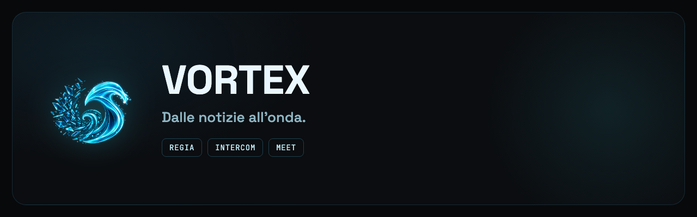
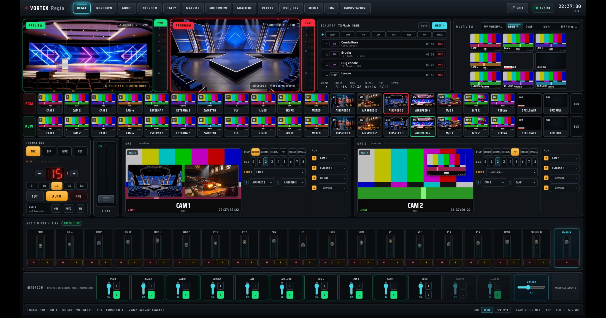
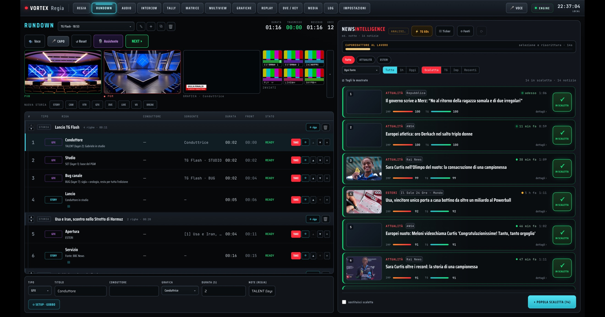
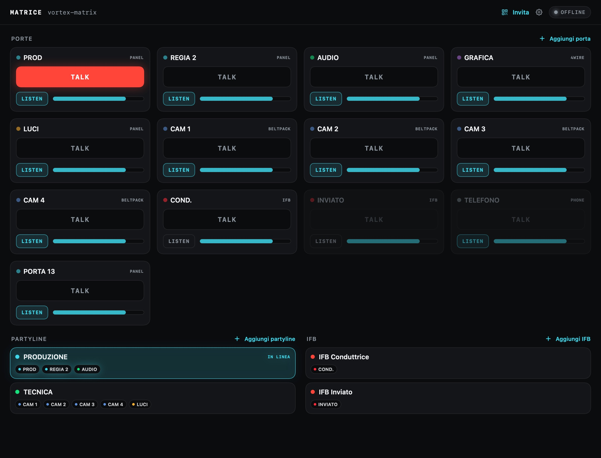

<strong>Italiano</strong> · <a href="README_EN.md">English</a>

🌐 <a href="https://solarys431.github.io/vortex-site/">Landing page</a>

---

## L'ecosistema

VORTEX è un ecosistema composto da quattro applicazioni modulari, progettate per la produzione televisiva e la comunicazione in tempo reale.

### VORTEX Regia — la centrale
VORTEX Regia riunisce switching, audio, tally, replay, grafiche e rundown e incorpora **NewsIntelligence**, un aggregatore di notizie basato sull'AI che raccoglie le fonti configurate, valuta le notizie e suggerisce la scaletta del TG. Il flusso va dalla notizia alla messa in onda; le decisioni finali restano alla regia e alla redazione.

  
  

[**→ vortex-control**](https://github.com/Solarys431/vortex-control) · [landing](https://solarys431.github.io/vortex-control/)

### VORTEX Intercom — la matrice
Intercom software in beta test esterno — TALK, LISTEN, partyline, IFB e supporto fino a 16 N-1 su interfacce compatibili — per iPhone, iPad e Mac. La regia gestisce la matrice e assegna le postazioni tramite inviti firmati.

[**→ vortex-intercom**](https://github.com/Solarys431/vortex-intercom) · [landing](https://solarys431.github.io/vortex-intercom/)

### VORTEX Meet — le riunioni
VORTEX Meet offre riunioni multilingue con traduzione simultanea in dieci lingue, sottotitoli tradotti, verbale e sintesi generati dall'AI al termine della sessione.

[**→ vortex-communication-os**](https://github.com/Solarys431/vortex-communication-os) · [landing](https://solarys431.github.io/vortex-communication-os/)

### VORTEX AI Graphic Studio — le grafiche
VORTEX AI Graphic Studio controlla le grafiche broadcast mediante comandi vocali, assistenza Gemini, SPX-GC e playout CasparCG.

[**→ vortex-ai-graphic-studio**](https://github.com/Solarys431/vortex-ai-graphic-studio) · [landing](https://solarys431.github.io/vortex-ai-graphic-studio/)

---

## La visione

Il principio comune dell'ecosistema è: **l'AI suggerisce, la regia e la redazione decidono**. Il percorso critico della messa in onda è progettato per restare indipendente dai servizi AI; questa architettura deve ancora essere validata sul campo.

---

## Stato

**Regia, Meet e AI Graphic Studio: prototipi funzionali. Intercom: beta test esterno su TestFlight.** Sito statico, senza cookie né tracciamento; le immagini mostrano i prodotti con dati dimostrativi.

© 2026 Daniele Cappello

